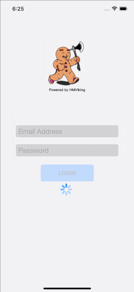
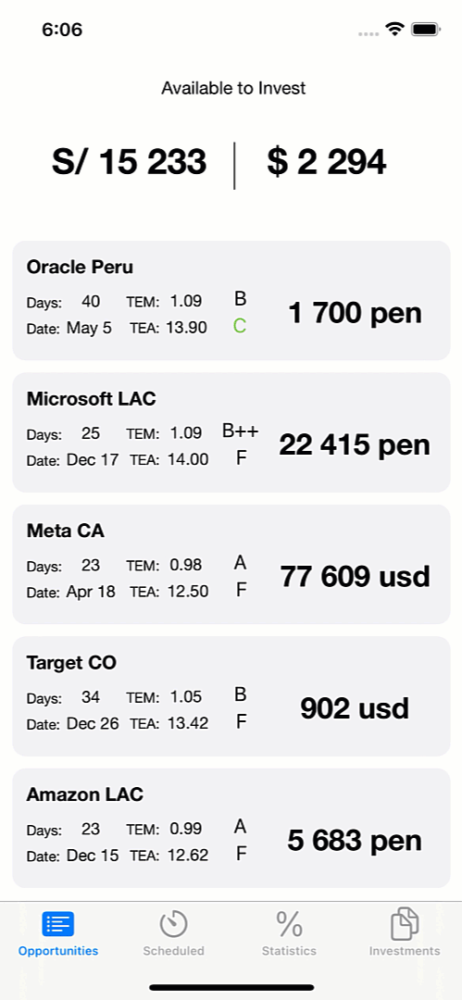
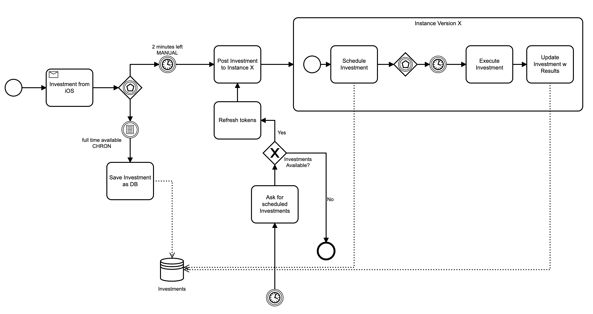

## Investment iOS Application
**PUBLIC VERSION**

**Disclaimer:** The following code shown is an excerpt from the base private code of which I am the creator and owner. This code is not functional, its purpose is only to demonstrate what has been built.

**Business Case:** In the market there are a number of invoice investment platforms which require constant attention from investors in order to obtain the best investment options regarding profitability, security and investment time, where time is a factor. key since it requires the investor to be permanently attentive to the platforms. The purpose of this application is to eliminate the time of attention to the platforms where each investment to be made can be scheduled and even more, it offers the possibility of making investments in a preferential way.

**Design:** The user will be able to visualize the open invoices for investment as well as the invoices that will be close to be able to invest, the system will handle this time of investment automatically. The user selects the invoice and must enter the amount to invest and accept. The available balance is dynamic with respect to the scheduled balance so that the investor knows how much money is to be invested vs. the real one. There is the possibility of seeing the scheduled investments and those that have already been executed with their respective status. Like the web version, there is information on KPIs as well as the list of investments made and the historical ones for analysis by investment.

**iOS Version:**
- Connection to REST API on GCP APP Engine
- Connection to Investment platforms

**CORE ACTIVITIES**

**EXTRA INFORMATION**

**DESIGN**

